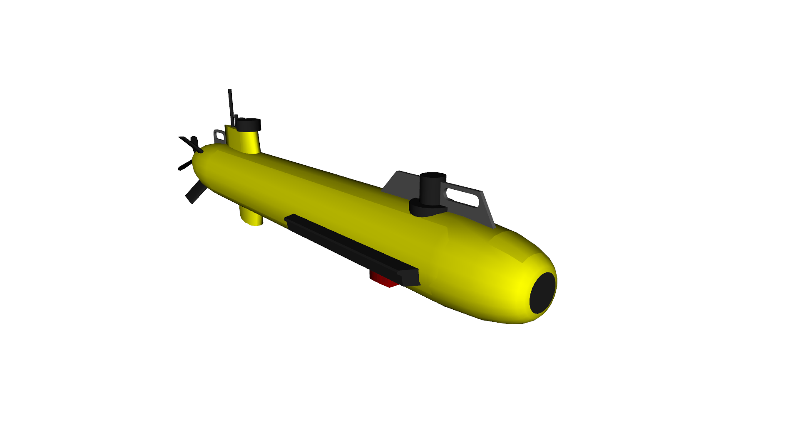

# ECA A9

This repository contains the robot description and necessary launch files to
simulate the [ECA A9 autonomous underwater vehicle](https://www.ecagroup.com/en/solutions/a9-s-auv-autonomous-underwater-vehicle).
This repository is complementary to the [Unmanned Underwater Vehicle Simulator (UUV Simulator)](https://github.com/uuvsimulator/uuv_simulator),
an open-source project extending the simulation capabilities of the robotics
simulator Gazebo to underwater vehicles and environments. For installation and
usage instructions, please refer to the [documentation pages](https://uuvsimulator.github.io/).



## Purpose of the project

This software is a research prototype, originally developed for the EU ECSEL
Project 662107 [SWARMs](http://swarms.eu/).

The software is not ready for production use. However, the license conditions of the
applicable Open Source licenses allow you to adapt the software to your needs.
Before using it in a safety relevant setting, make sure that the software
fulfills your requirements and adjust it according to any applicable safety
standards (e.g. ISO 26262).

## Requirements

To simulate the ECA A9 AUV, please refer to the [UUV Simulator](https://github.com/uuvsimulator/uuv_simulator)
repository and follow the installation instructions of the package. Then you can clone
this package in the `src` folder of you catkin workspace

```
cd ~/catkin_ws/src
git clone https://github.com/uuvsimulator/eca_a9.git
```

and then build your catkin workspace

```bash
cd ~/catkin_ws
catkin_make # or <catkin build>, if you are using catkin_tools
```

## Example of usage

To run a demonstration with the vehicle with teleoperation, you can run a UUV
simulator Gazebo scenario, such as

```bash
roslaunch uuv_descriptions ocean_waves.launch
```

and then

```bash
roslaunch eca_a9_gazebo start_demo_teleop.launch joy_id:=0
```

The teleoperation nodes are pre-configured per default for the XBox 360
controller.

## Configuration of the Gazebo world

The simulation with the fin plugins have shown better results by configuring
the Gazebo's `.world` file with the following parameters for the physics engine:

```xml
<physics name="default_physics" default="true" type="ode">
  <max_step_size>0.01</max_step_size>
  <real_time_factor>1</real_time_factor>
  <real_time_update_rate>100</real_time_update_rate>
  <ode>
    <solver>
      <type>quick</type>
      <iters>50</iters>
      <sor>1.2</sor>
    </solver>
  </ode>
</physics>
```

Check the [Mangalia world file](https://github.com/uuvsimulator/uuv_simulator/blob/master/uuv_descriptions/worlds/mangalia.world) to see an example.

## License

ECA A9 package is open-sourced under the Apache-2.0 license. See the
[LICENSE](LICENSE) file for details.
